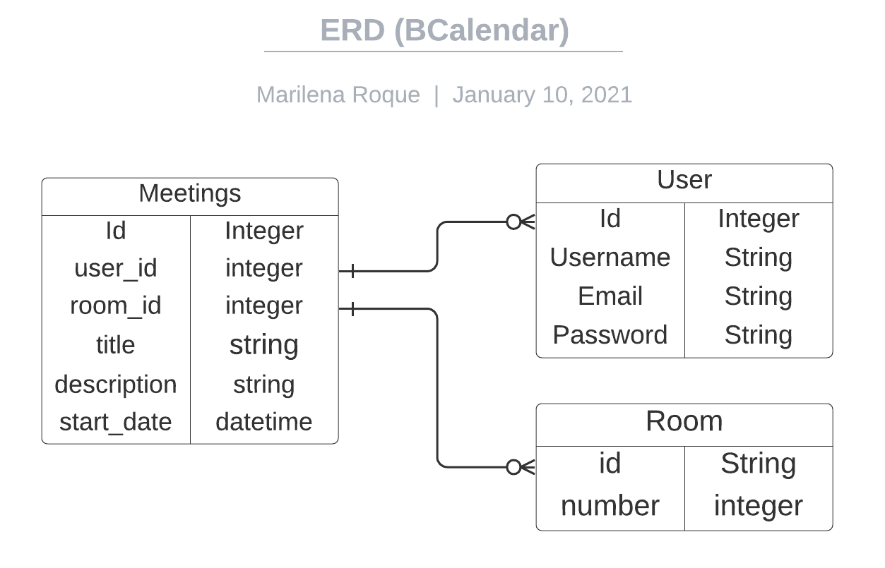

# BCalendar

> BCalendar is a modern application to help enterprises manage their company space.
> With BCalendar it is easy to manage rooms and booking meetings quickly, saving time and optimizing your company workflow.

## You can access our application [HERE](https://quiet-thicket-77774.herokuapp.com/)

## Usage

- You will need to sign up to have access to our application features. Please provide the information, no verification is required.

- The main page will display all the rooms available. You can create a new room by clicking on the 'plus' button in the 'Add Room' square. Or just use the option Create room in the navigation bar.
- Clicking on the calendar icon you can access the calendar to check the meetings in that room.
- To delete a room you should click on the 'Trash Icon'. Deleting a room all the meetings of it will be automatically deleted.

- To create a new meeting you should navigate to the day in the calendar of the room and click on the plus button.
- Provide the info required and make sure to check the periods when the meeting will happen.

## Development Info

This is a rails solution, using PostgreSQL for the database.

The project is based on 3 models

- User
- Room
- Meetings

Associated to each other as described below:

- A user can have zero or many 
meetings
- A Room can have zero or many meetings
- A Meeting belongs to a user and a room.

## Requested Features

If you're no authenticated User, you can

- Sign Up
- Sign In

If you are an authenticated user, you can:

- Create or Delete a Room
- See all the rooms and have access to their calendar
- Make a room reservation in the available periods

## Built With

- Ruby v2.7.1
- Ruby on Rails v6.0.3.4
- pg (1.2.3)

## Getting Started

To get a local copy up and running follow these simple example steps.

- Clone this repository
 > `git clone <repo url>`
- Open a terminal on the containing folder of this project
> `cd <folder>`

### Setup

- Install all the dependencies
> `bundle install`

- Initiate your database running
> `rails db:create`

- Set all the database running

> `rails db:migrate`

### Running tests

This repo contains files to test the validations and associations on models.
You can run the following command on your terminal to run the tests.

> ` rspec .`

or customize them by changing the files inside the spec folder.

### Running Locally

- Run the server using the command:

> `rails server`

- Access http://localhost:3000/ in your browser

- Use the navbar links to explore the features (make sure to create a user to have access to all features)

## Authors

👤 **Marilena Roque**

- Github: [MarilenaRoque](https://github.com/MarilenaRoque)
- Twitter: [@MariRoq88285995](https://twitter.com/MariRoq88285995)
- Linkedin: [roquemarilena](https://www.linkedin.com/in/roquemarilena/)

## 🤝 Contributing

Contributions, issues and feature requests are welcome!

Feel free to check the [issues page](issues/).

## Show your support

Give a ⭐️ if you like this project!